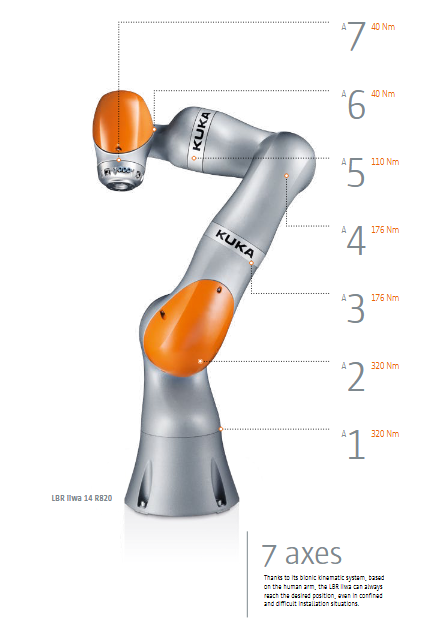

# Análisis de las características de robot KUKA

Este repositorio contiene el desarrollo del laboratorio 1 de la materia de robótica de la Universidad Nacional de Colombia periodo 2021-2. En este se laboratorio se realiza el análisis de las características  y modelo geométrico directo para el robot KUKA LBR iiwa 7 R800 height.

